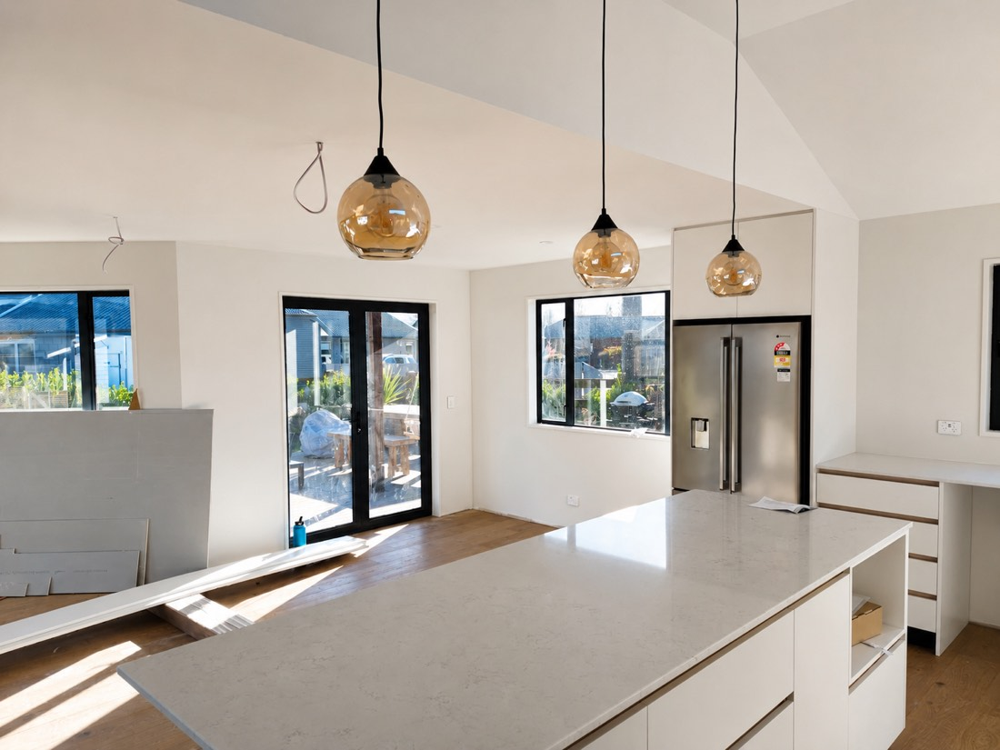

# Everest Painters — website admin

An admin login at `/admin.html` that lets you change **any text and any image**
on the site without touching code. Edits save to Supabase and appear on the live
site immediately — there is no rebuild and no deploy.

---

## One-time setup (about 5 minutes)

### 1. Create the database table and image bucket

The SQL lives in the Principal Synergy repo, because that is the repo that
tracks migrations for this Supabase project:

    principal-synergy/supabase/migrations/0047_everest_site_cms.sql

Supabase dashboard → **SQL Editor** → **New query** → paste that file → **Run**.
(Already applied to production on 2026-09-03.)

This creates, in the **Principal Synergy** project (`okwjuvhjrwidhqtzeguv`),
alongside the CRM but entirely separate from it:

| What | Where | Who can read | Who can write |
|---|---|---|---|
| `everest_site_content` table | Database | anyone (it is public website copy) | listed Everest editors only |
| `everest-site-images` bucket | Storage | anyone | listed Everest editors only |
| `everest_site_editors` table | Database | nobody from the browser | SQL editor only |

It does **not** touch `public.site_content` — that table is the Principal
Synergy marketing site's, has a different shape, and is gated by a different
role. Keeping them apart is what stops an Everest login from reaching CRM
content, and a CRM editor from reaching Everest's.

Row level security is on throughout, so the publishable key in the browser can
only ever read.

### 2. Paste the publishable key

Supabase dashboard → **Project Settings → API Keys** → copy the **publishable**
key (starts `sb_publishable_...`), *not* `service_role`.

Open `assets/cms-config.js` and replace the placeholder:

```js
anonKey: 'PASTE_PUBLISHABLE_KEY_HERE',
```

This key is meant to be public — it is what the RLS policies above are for.
**Never put the `service_role` key in this file.**

### 3. Create the admin login

Supabase dashboard → **Authentication → Users → Add user → Create new user**:

- Email: whoever should be able to edit the site
- Password: set one
- Tick **Auto Confirm User** — without it the login fails silently

### 4. Grant that user editing rights

Creating the account is not enough on its own; a Supabase user with no entry in
`everest_site_editors` can read the site but cannot save anything. In the **SQL
Editor**, with their email:

```sql
insert into public.everest_site_editors (user_id)
select id from auth.users where email = 'you@example.com'
on conflict (user_id) do nothing;
```

Repeat per person. To revoke access without deleting the account:

```sql
delete from public.everest_site_editors
where user_id = (select id from auth.users where email = 'you@example.com');
```

Then commit and push — Vercel redeploys automatically.

---

## Using it

1. Go to **`/admin.html`** and sign in.
2. You land on the homepage in edit mode. Every editable thing gets a dashed
   outline.
3. **Click any text** → a panel opens on the right with a box to type in. The
   page updates as you type.
4. **Click any image** → drop a new photo in, or click to choose one. Add alt
   text (the description used by screen readers and Google).
5. **Save** publishes to the live site straight away.
6. **Reset to original** on any element puts back what the page shipped with.

The toolbar switches between `index`, `gallery`, `terms` and `privacy`, and the
**SEO** button edits the browser tab title and the Google search description.

Unsaved changes are kept while you move around the page, but not across a
reload — the browser warns you before you lose them.

---

## How it works

Every editable element in the HTML carries a stable key:

```html
<h3 data-cms="index.services.h3_2" data-cms-type="text">Interior and exterior repaints</h3>

```

`assets/cms.js` reads `everest_site_content` and applies any row whose key matches.
The HTML in the repo is always the fallback: if Supabase is unreachable, if the
key is missing, or if a row is deleted, the page shows exactly what it shows
today. Nothing can white-screen the site.

Content types:

| `data-cms-type` | Meaning |
|---|---|
| `text` | Replaces the element's inner HTML. A few blocks contain `<b>` or `<a>` on purpose — the panel warns you when that is the case. |
| `textnodes` | Buttons with an icon. Only the words change, the icon is left alone. |
| `image` | Swaps `src` and `alt`. `srcset` is dropped on replaced images so the browser cannot fall back to the original file. |
| `attr:content` | The `<meta name="description">` tag. |

### Re-running the annotator

If the HTML is edited by hand later and new sections are added, re-run:

```bash
python3 tools/annotate.py index.html gallery.html terms.html privacy.html
```

It only ever inserts `data-cms` attributes and skips elements that already have
one, so existing keys — and therefore existing saved content — stay valid.

### Things worth knowing

- **Search engines see the HTML defaults, not the edited copy.** That was the
  accepted trade-off for instant publishing. If a change matters for SEO (page
  title, description, headings), fold it back into the HTML at some point.
- **Replaced images are served from Supabase Storage**, not from `/img`, and
  they skip the responsive `srcset` the original photos use. Resize photos to
  roughly 1600px wide and under ~1MB before uploading.
- **Uploads are never deleted automatically.** Old files stay in the bucket; tidy
  them up in the Supabase dashboard if it gets cluttered.
- `/admin.html` is `noindex` and disallowed in `robots.txt`.
